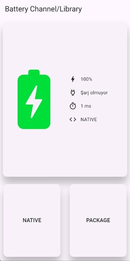
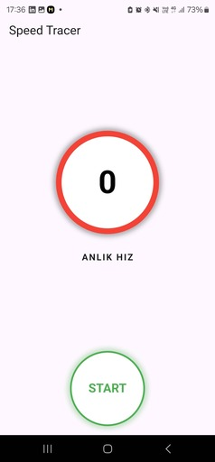
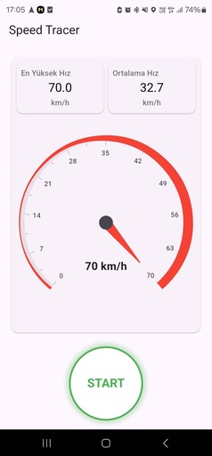

# Selamlar 👋 / Hi There 👋

## 🚀 Flutter Use Case

**Flutter ile ilgili çeşitli kullanım senaryolarını ve bileşenleri denemek amacıyla oluşturulmuş bir çalışma alanıdır.** 

🎯 **Native / Package (platform_channel)** 
 - Test amaçlı Google Ads eklenmiştir.(google_mobile_ads)
 - Batarya Bilgisini Alabilmek için ***Android*** tarafında ***Kotlin*** kullanılarak ***Native*** kod yazıldı ve ***battery_plus*** paketiyle aynı  verilere erişilmek istendi . İşlemler süresince bir timer başlatıldı ve bu işlemlerin kıyaslanması amaçlandı  

  
  

🎯 **Speed Tracer (speed_tracer)** 
***Araçların hız göstergelerinde zaman zaman sapmalar olabileceğini biliyoruz. Gerçekte en yüksek ulaştığım hız neydi ya da seyahat süresince ortalama hızım kaçtı gibi sorular, uzun süredir aklımı kurcalıyordu. Bu meraktan yola çıkarak, bu sorulara net cevaplar verebilecek bir uygulama geliştirdim.***
- ***geolocator*** kütüphanesi kullanılarak kullanıcının konum verisine erişildi ve konum değiştirme olayları dinlenilerek. Anlık hız ve En yüksek hız değerlerine ulaşıldı.
- ***syncfusion_flutter_gauges*** kütüphanesi kullanılarak animasyonlu bir şekilde hız göstergesi yapılması sağlandı.

  
  

